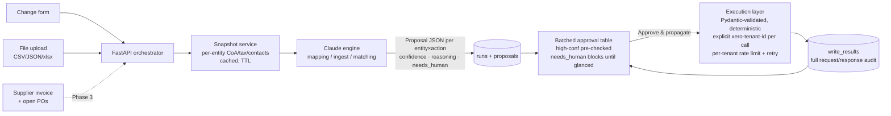

# Canopy — Multi-Entity Command Centre: Implementation Plan

## Context

Xero "Rise of the Builder" hackathon build (4–5 Jul 2026), grounded in 8 AirHop stakeholder interviews plus a technical onboarding with their BI lead. The repo (`master` branch) is greenfield: only `Canopy-multi-entity-command-centre-build-spec.md`, `Interview Synthesis — Pain Points, Ideas & Key insights.md`, and a `.gitignore`. Everything below is net-new code.

Targets: **Bounty 01** (Productivity Powerhouse) via multi-entity propagation; **Bounty 02** (Vibe Integrator, $3,000) via the universal ingest adapter. Judging: 50% real problem + Xero use · 30% API integration · 20% production-ready architecture.

**Locked decisions (do not re-litigate):**
1. Direct API via `xero-python` SDK with explicit per-request tenant IDs; **one** standard OAuth 2.0 auth-code app connected to multiple orgs (Custom Connections are per-org paid and not viable for trial orgs). Separately fork `XeroAPI/xero-mcp-server` (which hardcodes `tenants[0]` in `src/clients/xero-client.ts`), add a `XERO_TENANT_ID` env override, open an upstream PR.
2. Scope: Phases 0–2 committed; Phase 3 (PO-to-Bill) starts only after 1–2 are demo-frozen, cut freely.
3. PO-to-Bill creates bills as **DRAFT** only and **never** marks the PO as BILLED (the interviewees' #1 AP pain is Xero's native copy-to-bill doing exactly that, breaking ApprovalMax).
4. Name: Canopy.

**Verified Xero facts to build against:** account creation needs raw `PUT Accounts` (no MCP tool; required fields Code/Name/Type) — account-code propagation is CORE (Claire's literal #1 ask). Bills = `create-invoice` type ACCPAY. POs via raw `PurchaseOrders` endpoint. Rate limits 60/min + 5,000/day **per tenant** (fan-out parallelises safely; per-tenant limiter still required). Uncertified apps: 25 tenants max, max 2 uncertified-app connections per org. Use **granular scopes** (broad scopes deprecated Mar 2026) — confirm exact names on developer.xero.com during build. LLM: **Azure AI Foundry via the OpenAI-compatible SDK** (`openai` package; `AzureOpenAI`, or `OpenAI(base_url=...)` for a serverless/OpenAI-compatible endpoint), structured outputs via forced tool calling; the LLM only proposes, deterministic validated code writes.

## What the user must do by hand (blockers for live runs, not for coding)

The implementer codes everything against these as `.env` placeholders and mocks; the user supplies:
1. Xero developer app (auth-code flow, granular scopes + `offline_access`, redirect `http://localhost:8000/auth/xero/callback`) → `XERO_CLIENT_ID` / `XERO_CLIENT_SECRET`.
2. **3 UK trial orgs** under one Xero login ("Add organisation"; Demo Company is one-per-user so trials are needed). Confirm provisioning with a Xero mentor first — highest-risk item.
3. `ANTHROPIC_API_KEY`; a generated `CANOPY_FERNET_KEY` for token encryption.

Provide `.env.example` documenting all of these plus `DATABASE_URL` (SQLite default).

## Repo layout

```
backend/
  app/main.py              # FastAPI app + routers
  app/config.py            # pydantic-settings; reads .env
  app/db.py, app/models.py # SQLAlchemy: entities, tokens, snapshots, runs, proposals, write_results
  app/xero/auth.py         # consent URL, callback, encrypted token store (Fernet), auto-refresh
  app/xero/client.py       # xero-python wrapper; EVERY call takes explicit tenant_id; raw httpx for Accounts PUT + PurchaseOrders
  app/xero/ratelimit.py    # per-tenant 60/min limiter + 429 retry w/ backoff
  app/snapshots.py         # per-entity accounts/tax-rates/contacts/items/tracking cache (TTL, DB-backed)
  app/engines/mapping.py   # Claude mapping engine (per-entity propagation)
  app/engines/ingest.py    # Claude schema-inference for uploaded files
  app/engines/matching.py  # Phase 3: PO↔invoice matching
  app/engines/contracts.py # Pydantic: Proposal {entity, action, mapped_payload, confidence, reasoning, needs_human}
  app/execution.py         # deterministic writes: validate payload → write → record result; idempotency keys
  app/routers/{auth,entities,changes,ingest,runs}.py
  tests/                   # golden tests (recorded snapshots), payload validation, rate-limiter w/ mocked 429s
seed/seed.py               # seeds 3 orgs: mismatched CoAs (B: no 200, has 201 Trading Income; C: no plausible income acct), contact variants ("Acme Corp"/"Acme Corporation Ltd")
seed/fixtures/             # sortly_stock_count.csv (messy headers, missing value), roller_revenue.csv, supplier_invoice.json
frontend/                  # Next.js + Tailwind, ≤4 screens: Entities/health · New change + Ingest upload · Approval table · Run history
scripts/smoke.py           # live E2E once .env is real
docs/architecture.md       # diagram + pitch notes
CANOPY-IMPLEMENTATION-PLAN.md  # this plan, saved at repo root (user request)
```

## Data flow



Key rule stated everywhere (code, README, pitch): **Claude proposes structured JSON; only deterministic schema-validated code writes, only after human approval; tenant ID is explicit per request, never cached globally.**

## API surface

- `GET /auth/xero/connect` → consent URL · `GET /auth/xero/callback` → store tokens, upsert tenant registry
- `GET /entities` (+ per-entity health: connected, snapshot age)
- `POST /changes` {change_type: contact|item|account|tracking, payload, target_entity_ids} → creates run, fans out mapping engine, returns proposals
- `POST /ingest` (multipart file) → schema inference → same proposal shape
- `GET /runs`, `GET /runs/{id}` · `POST /runs/{id}/approve` {row selections + inline edits} → execute → per-row results
- Phase 3: `POST /matching/po-bill` {invoice JSON, entity_id}

## Build order

**Phase 0 — Foundations.** Scaffold both apps; connections module (consent → encrypted tokens → refresh → tenant registry); prove `GET /Organisation` for all 3 tenants (or against mocked transport until creds arrive); seed script. *Gate: 3 tenants listed with live reads, or full mocked path green.*

**Phase 1 — Propagation core (Bounty 01).** Snapshot service → mapping engine (strict JSON contract, refusal instruction, golden tests) → change types: contact (dedup link-vs-create), item (account/tax mapping — the demo's intelligence moment: `200 Sales` → `201 Trading Income` in org B, refusal in org C), **account code** (raw PUT), tracking → execution layer → approval UI. *Gate: full demo path rehearsable before Phase 2.*

**Phase 2 — Universal ingest (Bounty 02).** Upload + parse CSV/JSON/xlsx → Claude infers what the file *is* (no per-source connectors — the bounty's "universal translator" line verbatim), normalises to per-entity intents → new write type `create-manual-journal` → same approval table. Demo payloads: Sortly-style stock CSV (Niro's explicit "fully automatable" chain: Sortly → Excel → journal) and Roller-style revenue export (Callum's daily manual reconciliation). Include one graceful-refusal beat (unmappable column → `needs_human`, no write).

**Phase 3 — PO-to-Bill (sequenced, cut freely).** Read open POs (raw endpoint) + structured sample invoice (no OCR) → matching engine (partial delivery, reordered/renamed lines; reuse Phase 1 account/tax mapping for line coding) → `create-bill ACCPAY, status=DRAFT`, PO untouched → same table. Stretch-on-stretch: fan an approved recharge bill across entities.

**Phase 4 — Toolkit PR + polish.** Fork `xero-mcp-server`, ~5-line `XERO_TENANT_ID` env override in `xero-client.ts`, upstream PR (pitch: "we found and fixed the official MCP server's multi-tenant limitation"). Entity-health touches, README + architecture diagram, backup demo video, 3-min script per spec §9 updated (account-code now core; ingest beat for Bounty 02; PO as encore).

**Pitch ammunition from the synthesis (first names only, for privacy):** Claire's 20-entity expense-code quote; Tim's approval-fatigue warning → batched approval; Anita's *"'It's the computer what did it' isn't a defence"* → per-row reasoning + audit trail; Tamika/Anna/Emily on the copy-to-bill/ApprovalMax breakage → DRAFT-only design; the BI lead's portal (shared cache, DynamoDB run history) → snapshot cache + run history as "productionising the internal proof-of-concept." Say **"eight interviews plus a technical deep-dive with their BI lead"** — not nine.

## Verification

- **Without credentials (CI-able):** pytest — Pydantic payload validation; mapping-engine golden tests on recorded snapshot fixtures (deterministic asserts on mapped account codes and `needs_human`); rate-limiter/retry with mocked 429s; execution layer against a fake Xero transport (partial-failure fan-out recorded and retriable).
- **With credentials (`scripts/smoke.py`):** connect 3 orgs → propagate contact (clean) → item (forces 200→201 in B, refusal in C) → new expense code → ingest messy CSV → approve → **verify via direct API reads** that objects exist per org with mapped codes → run history shows full audit.
- **Failure paths:** kill network mid-fan-out → partial results recorded, retriable; unmappable file → refusal, zero writes.

## Post-approval bookkeeping (first steps of implementation)

1. Save this plan verbatim to repo root as `CANOPY-IMPLEMENTATION-PLAN.md` (user request).
2. Write project memory (Canopy context, four locked decisions, corrected Xero facts — Custom Connection economics, MCP `tenants[0]`, granular scopes, per-tenant rate limits) and update the `MEMORY.md` index.
3. Then Phase 0.
