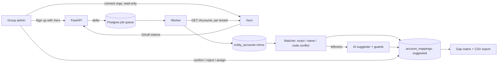

# Canopy v2 — Architecture

## Data flow

## Tenancy and isolation

A **workspace** is one customer group. Every tenant table carries `workspace_id`, and
Postgres row-level security filters on `app.workspace_id`, which each transaction sets
with `set_config(..., true)` (transaction-local, so pooled connections never leak context).
The API and worker connect as `canopy_app`, which owns no tables, so RLS always applies;
migrations run as the owner.

| Table | Visibility |
|---|---|
| workspace tables (entities, accounts, mappings, standard, connections, invitations, sync runs) | current workspace only |
| `workspaces` | members |
| `memberships` | current workspace, plus the user's own memberships (to list workspaces) |
| `users` | yourself, plus members of the current workspace; created only via `canopy_upsert_user` |
| `audit_events` | workspace events in the workspace; user-level events to that user; INSERT/SELECT only |
| `sessions`, `oauth_states`, `xero_quota` | no RLS — looked up before any context exists; hashes, ids, counters only |

Three `SECURITY DEFINER` functions cover the moments with no context yet: user upsert at
login, invitation acceptance (uses the session's user and requires the invited email to
match), and listing active entities for the nightly sync (ids only).

## Identity and Xero connections

- **Identity:** Sign Up with Xero (OIDC `openid profile email`) → server-side session.
- **Data:** a workspace admin separately grants `accounting.settings.read` (+
  `offline_access`). A token only reaches the orgs *that* Xero user authorised, so a
  workspace can hold several connections; each entity records which one it uses.
- OAuth round-trips use a single-use state row with nonce and PKCE verifier.

## Jobs

procrastinate on the same Postgres. Xero jobs take `lock = tenant:<id>` so one tenant's
calls never race each other against its rate limit, whichever worker runs them;
`queueing_lock` keeps at most one pending sync per entity. Jobs are enqueued *after* the
request's transaction commits (FastAPI background tasks), so a worker never reads data
that isn't there yet.

## Mapping model

`account_mappings` maps one org account to at most one group account (many-to-one), with
`status` (suggested / confirmed / rejected), `source` (exact / name / code_conflict / ai /
unmatched / manual / created), confidence and reasoning. A confirmed mapping with no group account means
"deliberately local-only". Re-suggesting only rewrites rows still `suggested`.

## Change control (Milestone 2)

A `change_set` is one intent; its `change_items` are one operation in one org
(`create_account`, `update_account`, `archive_account`). Set lifecycle:
`draft → submitted → approved | rejected → executing → completed | partial | failed`
(`cancelled` from draft or submitted).

- **Who:** preparers, admins and the owner author; approvers, admins and the owner decide.
  The author never rejects their own set (they cancel it) and approves it only when *all*
  of these hold (`service.self_approval_blocker`):
  - the owner has allowed self-approval;
  - no other member holds a deciding role, so it's only ever for a lone approver;
  - every item only aligns an org to the standard: a create whose payload is exactly the
    group account's defaults, or a rename (name only) of an account confirmed against a
    group account to that group account's name. Never an archive or a code change;
  - the author gives a note.

  The set is recorded as `self_approved` and sits in a review queue (`needs_review`)
  until a different decider marks it reviewed (`reviewed_by/at/note`, audited as
  `change.reviewed`; a check constraint forbids the author). All of this is enforced in
  the service layer; the UI only mirrors it.
- **Preflight** (`changes/preflight.py`, pure functions): unique code and name across all
  accounts including archived, valid type (no `BANK` creates), tax type exists, is active
  and applies to the account's class in that org, not a system account, not already
  archived, write scope granted. Runs when items are added, at submit (blocked items stop
  submission), and again at execution after an incremental sync and a live read of the
  account.
- **Execution** (`changes/executor.py`): one job per item under the tenant lock. The
  `Idempotency-Key` is `canopy-<item>-<attempt>`: automatic retries (429s, timeouts) reuse
  it; an explicit retry increments the attempt so a cached failure isn't replayed; an item
  found still `running` (the worker died mid-write) replays the write with the same key
  instead of re-validating against its own result. Before/after, the mirror, the mapping
  (a created account is confirmed against its group account, source `created`) and the
  audit log are updated; the set status rolls up under a row lock.
- **Switches:** `workspaces.changes_enabled` (owner) and the server kill switch
  `XERO_WRITES_ENABLED` (on by default in development only).

## Tracking categories (Milestone 2b)

Same shape as accounts, one level deeper (a category holds options):

- **Mirror:** each sync reads an org's tracking in full (`includeArchived=true`; at most
  four categories, so one small call) into `entity_tracking_categories` / `_options`.
  Archived ones are kept: they count towards Xero's limits and block reusing a name.
  Unlike accounts, an empty response is a real answer (an org may have none), so it
  marks the mirror deleted (soft, so mappings survive).
- **Standard:** `group_tracking_categories` / `_options`, seeded from one org or edited.
  At most **two active** categories, because Xero allows two per org: a standard with
  three could never be met. Names unique case-insensitively (categories in the
  standard, options in their category).
- **Mapping:** `tracking_category_mappings` / `tracking_option_mappings`, same lifecycle
  as account mappings. Exact normalised-name matches only, no AI (lists are short).
  An option maps only within the group category its own category maps to, and is
  confirmed only after that category is; changing a category's mapping drops option
  mappings that no longer fit and re-suggests them.
- **Gaps:** per group category and option × org. An option cell is `no_category` when the
  org lacks the category itself (create the category first).
- **Changes:** `create_tracking_category` (with its options), `create_tracking_option`,
  `update_tracking_category` / `_option` (renames), `archive_tracking_category` /
  `_option`. No deletes: Xero only deletes never-used ones, and archiving is reversible.
  Preflight (`tracking/preflight.py`) encodes Xero's rules: two active / four total
  categories, names 1–100 characters, unique among the org's categories (archived
  included) and among a category's options. Creating a category is several writes, each
  with a key derived from the item's (`…-category`, `…-option-<n>`); the category's
  Xero id is saved on the item (`created_xero_id`) as soon as it exists, so a retry adds
  only the missing options instead of creating the category twice. Self-approval
  extends to tracking: only items that bring an org into line with the standard, never
  archives.

## Failure behaviour (tested)

- Full sync returning zero accounts never marks the mirror deleted.
- Long `Retry-After` / daily limit → job rescheduled, entity marked with the error.
- Refresh token rejected → connection marked `revoked`; the org needs reconnecting.
- AI suggests a code that doesn't exist or crosses account classes → discarded by guards.
- Account changed in Xero after approval → execution preflight fails → nothing written.
- Xero validation error → the item fails with Xero's message; other orgs continue.
- Worker dies mid-write → the retry replays the same Idempotency-Key.
