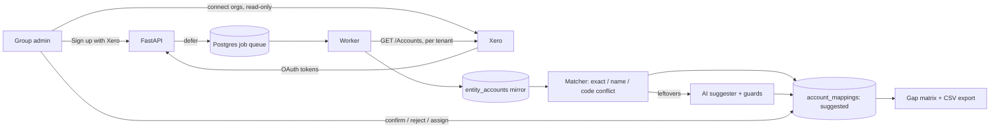

# Canopy v2 — Architecture

## Data flow

## Tenancy and isolation

A **workspace** is one customer group. Every tenant table carries `workspace_id`, and
Postgres row-level security filters on `app.workspace_id`, which each transaction sets
with `set_config(..., true)` (transaction-local, so pooled connections never leak context).
The API and worker connect as `canopy_app`, which owns no tables, so RLS always applies;
migrations run as the owner.

| Table | Visibility |
|---|---|
| workspace tables (entities, accounts, mappings, standard, connections, invitations, sync runs) | current workspace only |
| `workspaces` | members |
| `memberships` | current workspace, plus the user's own memberships (to list workspaces) |
| `users` | yourself, plus members of the current workspace; created only via `canopy_upsert_user` |
| `audit_events` | workspace events in the workspace; user-level events to that user; INSERT/SELECT only |
| `sessions`, `oauth_states`, `xero_quota` | no RLS — looked up before any context exists; hashes, ids, counters only |

Three `SECURITY DEFINER` functions cover the moments with no context yet: user upsert at
login, invitation acceptance (uses the session's user and requires the invited email to
match), and listing active entities for the nightly sync (ids only).

## Identity and Xero connections

- **Identity:** Sign Up with Xero (OIDC `openid profile email`) → server-side session.
- **Data:** a workspace admin separately grants `accounting.settings.read` (+
  `offline_access`). A token only reaches the orgs *that* Xero user authorised, so a
  workspace can hold several connections; each entity records which one it uses.
- OAuth round-trips use a single-use state row with nonce and PKCE verifier.

## Jobs

procrastinate on the same Postgres. Xero jobs take `lock = tenant:<id>` so one tenant's
calls never race each other against its rate limit, whichever worker runs them;
`queueing_lock` keeps at most one pending sync per entity. Jobs are enqueued *after* the
request's transaction commits (FastAPI background tasks), so a worker never reads data
that isn't there yet.

## Mapping model

`account_mappings` maps one org account to at most one group account (many-to-one), with
`status` (suggested / confirmed / rejected), `source` (exact / name / code_conflict / ai /
manual), confidence and reasoning. A confirmed mapping with no group account means
"deliberately local-only". Re-suggesting only rewrites rows still `suggested`.

## Failure behaviour (tested)

- Full sync returning zero accounts never marks the mirror deleted.
- Long `Retry-After` / daily limit → job rescheduled, entity marked with the error.
- Refresh token rejected → connection marked `revoked`; the org needs reconnecting.
- AI suggests a code that doesn't exist or crosses account classes → discarded by guards.
