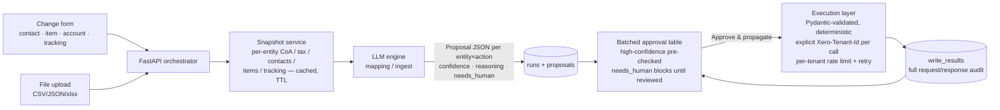

# Canopy — Architecture

One command centre where every change source flows through one AI mapping layer and one
batched approval surface into N Xero organisations.

## Data flow

## The rule enforced everywhere

**The LLM only proposes.** It emits structured JSON (forced tool calling) with per-row
`confidence`, `reasoning`, and `needs_human`. It may never invent an account code, tax type,
or tracking id — if nothing in the target org fits, it must refuse rather than guess. Only
deterministic, Pydantic-validated code writes, and only after a human approves. Tenant IDs
are passed explicitly per request (`Xero-Tenant-Id` header), never cached globally — per
Xero's own security guidance. No money movement by design.

Proposals are additionally checked by deterministic guards after the LLM
(`backend/app/engines/mapping.py`): referenced-code guard (payload references an account
code absent from the target chart → forced `needs_human`), account Code/Name collision
guard, and tracking-option shape coercion.

## Layers

| Layer | Implementation | Notes |
|---|---|---|
| Auth & tenancy | `app/xero/auth.py` | One standard OAuth 2.0 auth-code app connected to N orgs; tokens Fernet-encrypted at rest, auto-refreshed; tenant registry synced on callback |
| Xero I/O | `app/xero/client.py` | Every call takes an explicit `tenant_id`; raw HTTP for endpoints without SDK/MCP coverage (`PUT /Accounts`) |
| Rate limiting | `app/xero/ratelimit.py` | Xero limits are 60/min and 5,000/day **per tenant**, so cross-tenant fan-out parallelises safely; per-tenant limiter + 429 retry with backoff |
| Snapshots | `app/snapshots.py` | DB-backed TTL cache of each org's accounts, tax rates, contacts, items, tracking categories — the LLM maps against live org data, never assumptions |
| Engines | `app/engines/{mapping,ingest}.py` | Per-entity mapping and universal file-schema inference; shared `Proposal` contract in `engines/contracts.py` |
| Execution | `app/execution.py` | Validate → write → record; idempotent, per-row success/failure so a partial fan-out is recorded and retriable |
| Persistence | `app/models.py` (SQLite via SQLAlchemy, Postgres-ready) | `entities`, `tokens`, `snapshots`, `runs`, `proposals`, `write_results` — full request/response audit |
| UI | Next.js + Tailwind | Entity health · change form + ingest upload · batched approval table · run history |

## Why one OAuth app, not one Custom Connection per org

Custom Connections are paid per organisation (£5/month each), only available in AU/NZ/UK/US,
and cannot be purchased for demo/trial orgs. A single standard auth-code app supports up to
25 tenants uncertified; per-request tenant routing via the `Xero-Tenant-Id` header is the
supported multi-org mode. This finding also produced our upstream contribution: the official
MCP server hardcodes the first tenant, which we patched with a `XERO_TENANT_ID` override
(see "Toolkit contribution" in the README).

## Design principles (from the stakeholder research)

- **Batched, approve-first** — one review for the whole fan-out; avoids per-org approval
  fatigue (the Finance Director's explicit warning) while keeping a human on every write.
- **Show reasoning and confidence per row; refuse to guess** — accountability cannot be
  offloaded to the model (*"'It's the computer what did it' isn't a defence"*).
- **Auditability** — every run stores the full request/response trail, mirroring the audit
  pattern the group's BI lead had already built internally.
- **No money movement** — contacts, items, accounts, tracking categories, and draft manual
  journals only.

## Failure paths (tested)

- Unmappable file or column → graceful refusal (`needs_human`), zero writes.
- Network death mid-fan-out → partial results recorded per row, retriable.
- LLM proposes a nonexistent account code → deterministic guard forces `needs_human`
  before the API is ever called.
- 429 from Xero → per-tenant backoff and retry.
